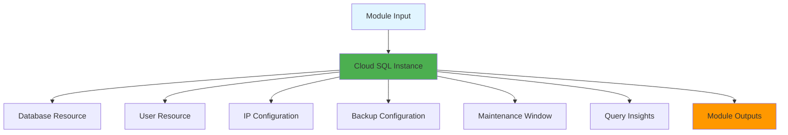
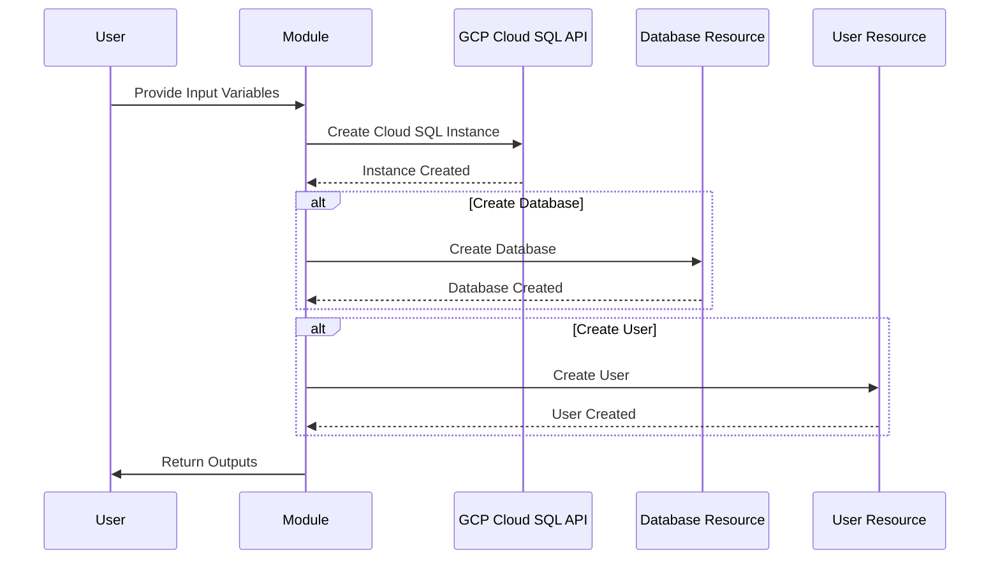
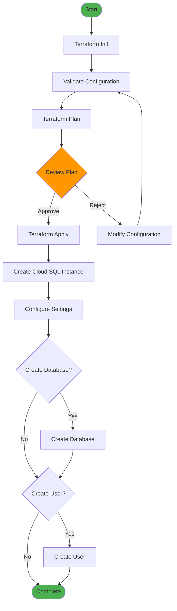
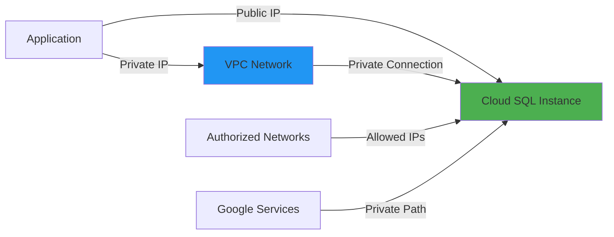
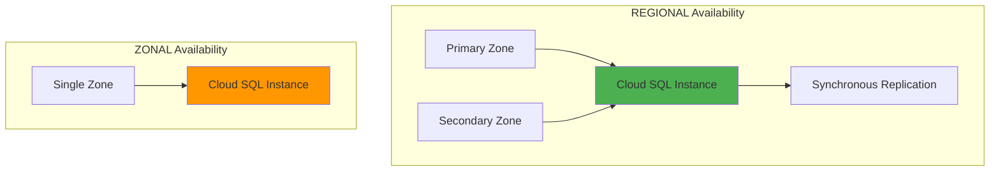
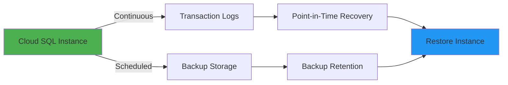
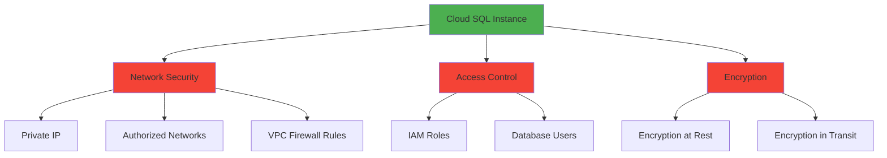

# GCP Cloud SQL Module Architecture

## Overview

Architecture, components, and deployment flow of the GCP Cloud SQL Terraform module.

## Module Structure

```
tf-gcp-cloud-sql/
├── main.tf              # Cloud SQL instance resource
├── variables.tf         # Input variables
├── outputs.tf           # Output values
├── locals.tf            # Computed values
├── versions.tf          # Provider constraints
└── tftest/              # Examples
    ├── basic/           # Basic example
    └── complete/        # Complete example
```

## Component Architecture



## Resource Flow



## Deployment Flow



## Network Architecture



## High Availability Architecture



## Backup & Recovery Flow



## Security Architecture



## Module Components

### Cloud SQL Instance
- Database version selection
- Machine tier configuration
- Disk and network settings
- Backup and maintenance windows
- Query insights

### Database Resource (Optional)
- Database name, charset, collation

### User Resource (Optional)
- User name, password, type (BUILT_IN/CLOUD_IAM)

## Best Practices

1. Use **Private IP** for production
2. Enable **Backups** with point-in-time recovery
3. Use **REGIONAL** availability for production
4. Enable **Query Insights** for monitoring
5. Use **Secret Manager** for passwords
6. Enable **Deletion Protection** for production

## Integration Points

- VPC Networks (Private IP)
- IAM (Access control)
- Cloud Monitoring (Metrics)
- Cloud Logging (Audit logs)
- Secret Manager (Passwords)
- Cloud KMS (Encryption keys)
